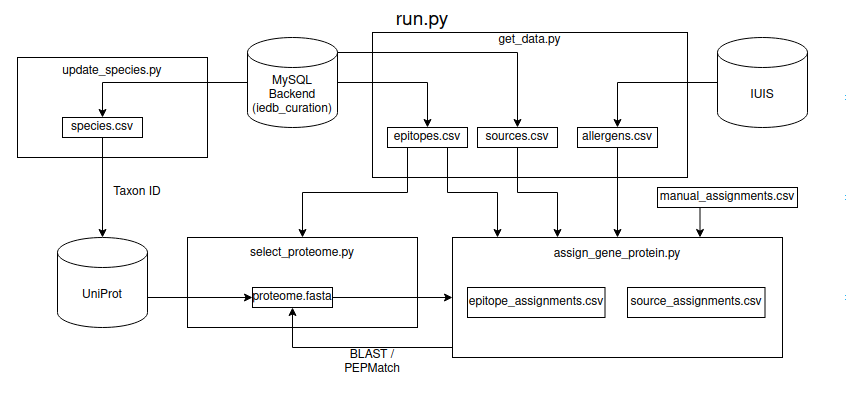

# IEDB Protein Tree 

Assigning IEDB source antigens and epitopes to their genes and proteins.

<b>Current Success Rates:</b>
- Source Antigen Assignment: 97.9%
- Epitope Assignment: 87.4%


### Process
1. Collect the epitope and source antigen data for a species.
2. Select the best proteome for that species from UniProt.
3. Assign gene/protein to source antigens and epitopes using BLAST, ARC, and PEPMatch.


### Inputs
- IEDB MySQL backend access
- List of IEDB species: [species.csv](data/species.tsv)
    - This is updated with [update_species.py](protein_tree/update_species.py)
- `blastp` and `makeblastdb` binaries from [NCBI](https://ftp.ncbi.nlm.nih.gov/blast/executables/blast+/LATEST/)
- `hmmscan` binary from [HMMER](http://eddylab.org/software/hmmer/)
- [manual_assignments.csv](data/manual_assignments.tsv) - manually assigned proteins
- `allergens.csv` - IUIS allergen nomenclature; get/update using [get_data.py](protein_tree/get_data.py)
- Flags (for [run.py](protein_tree/run.py))
    - `-a` - run for all species
    - `-t` - run for a single species using its taxon ID
    - `-d` - update epitope, source antigen, and allergen data
    - `-p` - update proteome to be used for the species
    - `-s` - update species list (runs [update_species.py](protein_tree/update_species.py))
    - `-n` - number of threads to speed up source antigen assignment


### Running

To run the entire pipeline:

- for one species:
```bash
protein_tree/run.py -t <taxon ID>
```
- for all species:
```bash
protein_tree/run.py -a
```

Getting the raw epitope and source antigen data can be run separately:

```bash
protein_tree/get_data.py -t <taxon ID>
```

Selecting the best proteome can also be run separately:

```bash
protein_tree/select_proteome.py -t <taxon ID>
```


### Outputs

For each species:
- proteome.fasta - selected proteome in FASTA
- source_assignments.csv - each source antigen with assigned gene and protein
- epitope_assignments.csv - each epitope with its source antigen and assigned protein
- [optional] gp_proteome.fasta - the gene priority proteome in FASTA if it exists

For all species:
- metrics.csv - the metadata from the build
    - Proteome ID
    - Proteome Taxon
    - Proteome Type
    - Source Antgigen Count
    - Epitope Count
    - Successful Source Assignement (%)
    - Successful Epitope Assignment (%)
- all_epitope_assinments.csv - combined epitope assignments for every species
- all_source_assignments.csv - combined source antigen assignments for every species

Use [combine_data.py](protein_tree/combine_data.py) to merge all the assignments into the `all_epitope_assignments.csv` and `all_source_assignments.csv` files.


### TODO
- Create a tree for visualization


### Workflow

<p align="center">
  
</p>